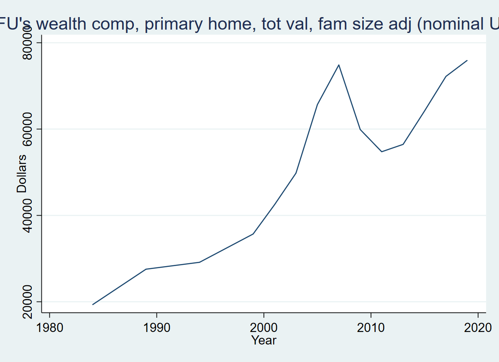
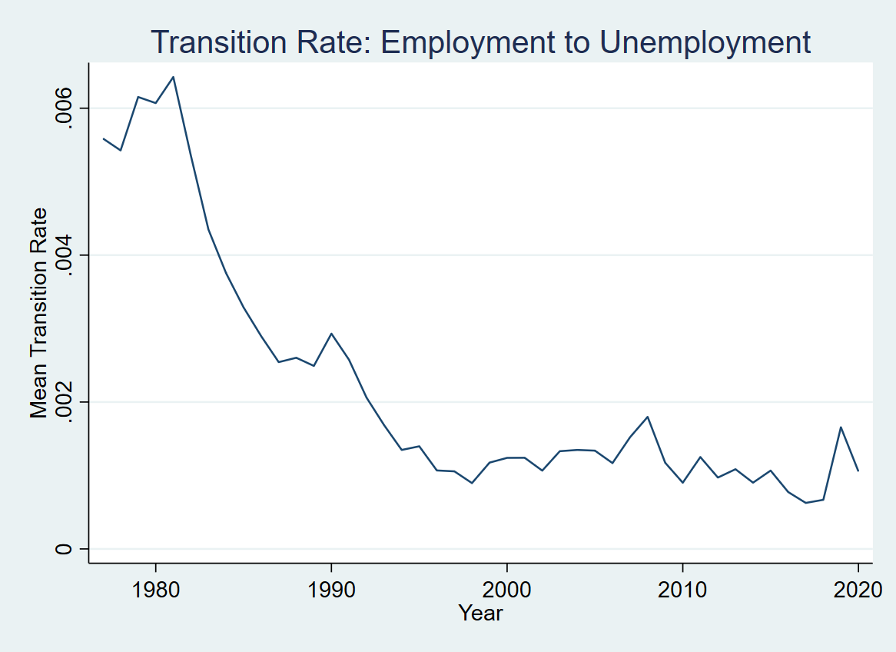
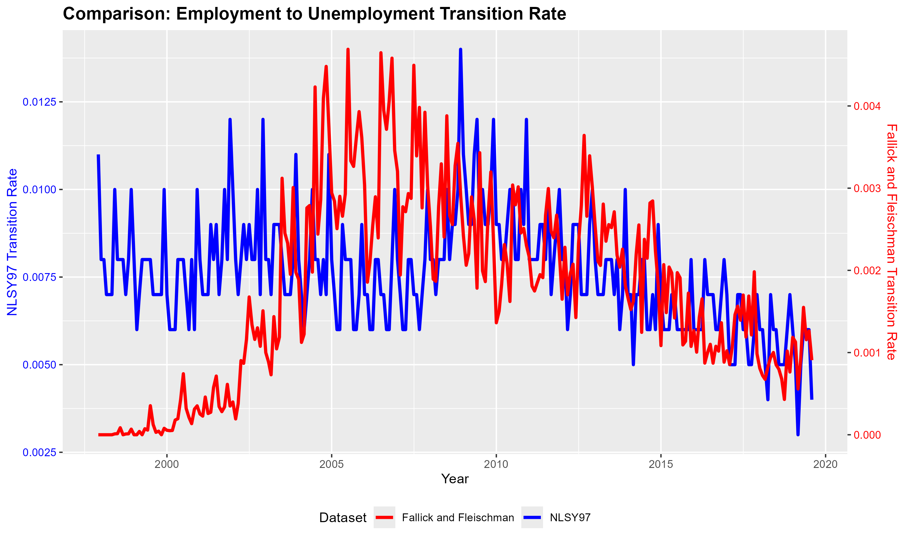
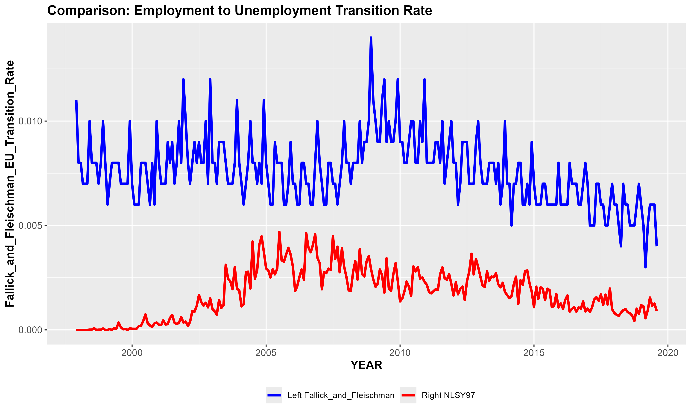

<div align="center">

# 📊 Labour-Market Transitions & Wealth Dynamics

**A cross-dataset study of how people move between _employment_, _unemployment_ and
_inactivity_ — and how income and wealth evolve over the life cycle.**

Built across four U.S. micro-datasets (PSID · NLSY79 · NLSY97 · CPS) and benchmarked
against FRED and the published rates of *Fallick & Fleischman* and *Shimer*.


</div>

---

## 📖 Overview

This repository collects my **research-assistant work in empirical labour economics**. The
core question is simple to state and hard to measure:

> **How often do workers flow between Employment (E), Unemployment (U) and Inactivity (I),
> and how do those flows — together with income and wealth — change over the life cycle and
> across cohorts?**

To answer it, I build harmonised individual panels from several major U.S. surveys, compute
population-weighted **E↔U↔I transition rates** and income/wealth trajectories, and validate
them against independent macro benchmarks. The work spans the full pipeline: raw-data
ingestion, panel construction, cleaning, weighting, estimation, visualisation, and LaTeX
write-ups — implemented in **Stata, R, Julia and Python**.

> ⚠️ **Data is not included.** The raw PSID / NLSY / CPS microdata are governed by
> data-use agreements and are **not redistributed here**. Only code, aggregate result
> graphs and write-ups are published — see [**Data availability**](#-data-availability).

---

## 📈 Selected results

<table>
  <tr>
    <td width="50%" valign="top">
      <br/>
      <sub><b>PSID — average family wealth</b> (primary-home component, family-size adjusted).
      The long climb, the 2007–08 housing collapse, and the subsequent recovery are all visible.</sub>
    </td>
    <td width="50%" valign="top">
      <br/>
      <sub><b>NLSY79 — employment → unemployment rate</b> as the 1979 cohort ages.
      Job-separation risk falls sharply as workers gain experience and tenure.</sub>
    </td>
  </tr>
  <tr>
    <td width="50%" valign="top">
      <br/>
      <sub><b>NLSY97 vs. Fallick &amp; Fleischman</b> (dual axis) — survey-derived transition
      rates validated against the published CPS-based benchmark series.</sub>
    </td>
    <td width="50%" valign="top">
      <br/>
      <sub><b>Employment → unemployment flows</b>, NLSY97 (red) vs. Fallick &amp; Fleischman
      (blue), 1998–2019. Levels differ by construction; the downward trend agrees.</sub>
    </td>
  </tr>
</table>

<div align="center"><sub>A small selection — the full set of result graphs lives in each dataset's <code>output/</code> folder.</sub></div>

---

## 🗂️ Datasets

| Dataset | Description | Role in the project |
|---|---|---|
| **PSID**   | Panel Study of Income Dynamics, 1968–2019 | Main panel: income, wealth, employment over 50+ years |
| **NLSY79** | National Longitudinal Survey of Youth, 1979 cohort | Life-cycle transition rates, monthly/weekly/quarterly |
| **NLSY97** | National Longitudinal Survey of Youth, 1997 cohort | Cohort comparison + benchmark validation |
| **CPS**    | Current Population Survey | High-frequency labour-force flows |
| **FRED**   | Federal Reserve Economic Data | Independent macro benchmark for the rates |

---

## 🧭 Repository structure

```
.
├── 01_PSID/              Main project — PSID income & wealth panel
│   ├── setup_framework/    Python tool to download PSID & generate Stata code
│   ├── code/
│   │   ├── data_prep/        one Stata script per PSID topic (income, wealth, …)
│   │   ├── analysis/         weighted_average_trends.do  ← main analysis
│   │   └── misc/             helper scripts & notebooks
│   ├── data/                (git-ignored — see Data availability)
│   ├── output/graphs/        result graphs
│   └── reports/              LaTeX reports (PDF)
│
├── 02_NLSY79/  03_NLSY97/   code · output graphs · reports  (data git-ignored)
├── 04_CPS/                  three approaches: vs-BLS, own build, Shimer method
├── 05_FRED/                 macro benchmark series & plots
├── 06_Employment/           transition rates vs Fallick & Fleischman / BLS
│
├── reports/                 cross-dataset LaTeX report (NLSYs.pdf)
├── README.md   LICENSE   .gitignore   CITATION.cff
```

---

## 🔬 What this demonstrates

- **Panel-data engineering** — turning raw, multi-year survey files into clean, harmonised
  individual panels (PSID reshape-to-long, NLSY monthly/weekly/quarterly aggregation).
- **Survey methodology** — population weighting, longitudinal weights, and careful E/U/I
  state definitions consistent across very different surveys.
- **Validation against the literature** — cross-checking estimates against FRED and the
  *Fallick & Fleischman* and *Shimer* benchmarks rather than reporting them in isolation.
- **Polyglot, reproducible workflow** — Stata · R · Julia · Python, with paths and steps
  documented so the pipeline can be re-run end to end.
- **Communication** — publication-style graphs and LaTeX reports.

---

## ▶️ Reproducing the analysis

1. Obtain the data (see below) and place each dataset's files under its `data/` folder.
2. **PSID (main):** run `01_PSID/code/analysis/weighted_average_trends.do`. For each variable
   it builds a population-weighted average (or weighted proportion) by year and exports a
   graph to `01_PSID/output/graphs/`. Set the paths in the `global` lines at the top first.
3. `01_PSID/reports/All.tex` stitches those graphs into a single PDF.
4. To rebuild the PSID panel from scratch, follow `01_PSID/setup_framework/readme.txt`.

> Scripts use absolute paths under `D:\PSID_SHELF\…`. If you clone elsewhere, find-and-replace
> that prefix with your own path.

---

## 📥 Data availability

The raw microdata are free to registered users from the official providers:

| Dataset | Source |
|---|---|
| PSID            | <https://psidonline.isr.umich.edu> |
| NLSY79 / NLSY97 | <https://www.nlsinfo.org> (NLS Investigator) |
| CPS             | <https://www.census.gov/cps> · <https://cps.ipums.org> |
| FRED            | <https://fred.stlouisfed.org> |

---

## 👤 Author

**Mohsen Khalili (Dermani)** — Research Assistant, empirical labour economics
✉️ mkhdermani@gmail.com · 🔗 [LinkedIn](https://www.linkedin.com/in/mohsenkhalili-dermani-3b08a5156)

This work was carried out as a research assistant for **E. Sepahsalari**.

---

## 📄 License

Code released under the [MIT License](LICENSE). The PSID `setup_framework/` is third-party
work by *Ben Griffy* under its own terms, and no survey microdata is included or licensed here.
